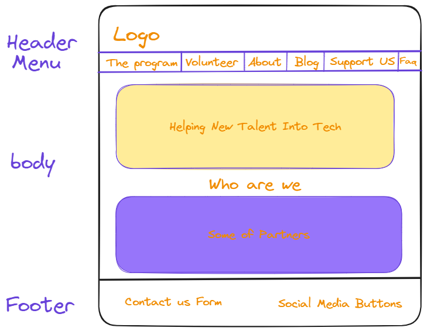

# Design

## Project's design overview

> This design is the sketch that we took from our project backlog, we are trying
> to make our website to be same as HackYourFuture website and it yet effective
> & informative, and considering colorful and attractive design specially for
> the young souls.

## Wireframe(s)

> Include your wireframe(s) and link to wireframe

<!-- provide a link to your wireframe documenting on Figma, or wherever it is -->
